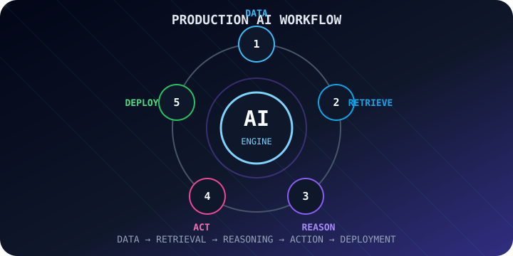
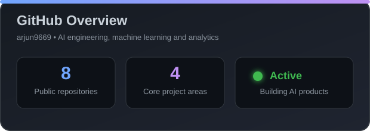

<!--
  GitHub Profile README for arjun9669
  Custom animated edition — all primary animations are stored inside this repository.
-->

  

  

---

## 👋 About Me

I am an **AI Engineer based in Dubai, UAE**, currently working at **Clever Feed IT Services** on practical enterprise AI initiatives across **document intelligence, Retrieval-Augmented Generation (RAG), multilingual AI workflows, automation, AI adoption, and proof-of-concept delivery**.

My public projects demonstrate Python/ML foundations, document-grounded RAG workflows, agent orchestration prototypes, API development, and scheduled AI automation. I focus on measurable, reproducible engineering rather than unverified production claims.

- Build and evaluate **enterprise AI and document-intelligence solutions**
- Support **AI adoption and employee enablement** for real-world business teams
- Develop **OCR + RAG + vector-search** workflows for private knowledge systems
- Work with **multilingual AI** and multilingual embeddings, including **BGE-M3**
- Designed **Router, Planner, Executor and Synthesizer** agent workflows
- Worked with operational datasets containing more than **2 million records**

 

---

## 🔎 Verifiable Engineering Evidence

| Project | Public evidence |
|---|---|
| **Doc Genius Local** (hosted demo) | [Launch live document Q&A](https://doc-genius-local.lovable.app/) · [Separate reference implementation](./projects/groundeddesk-ai/README.md) |
| **Glass Expert AI** (team project) | [Initial RAG pipeline contribution](https://github.com/MTAAI/Glass_Engineer/commit/29d459a5a3f43e064b8ad8dd682abec04229f99a) · [React UI and API contributions](https://github.com/MTAAI/Glass_Engineer/commit/75f7be7c6dc95690b8f0929a5381d29a4aa66ee9) · [Arjun branch](https://github.com/MTAAI/Glass_Engineer/tree/Arjun) |
| **AI Market Research Desk** (owned) | [Code and setup](https://github.com/arjun9669/ai-research-desk) · [GitHub Actions history](https://github.com/arjun9669/ai-research-desk/actions) |
| **Agentic RAG** (collaborative prototype) | [Router, Planner, Executor and Synthesizer source](https://github.com/zainmuhammadaimta/Agentic_rag/tree/main/src/agents) |

**Evidence note:** Public repository code and recorded benchmarks demonstrate the existence of features and experiments; they do not by themselves validate deployment scale, business savings, uptime or employer performance metrics. For team repositories, contributions are credited at commit/branch level.

---

## 🧠 Core Expertise

---

## 🛠️ Technology Stack

### AI, LLMs & Agent Frameworks

### Document Intelligence, RAG & Multilingual AI

### Machine Learning, Data & Backend

  

---

# 💼 Professional Experience

<strong>🤖 AI Engineer — Clever Feed IT Services, Dubai, UAE</strong>

 

**July 2026 – Present**

*Building and evaluating AI-enabled product and client solutions across document intelligence, automation, multilingual AI workflows, and proof-of-concept delivery.*

- Support AI adoption initiatives for **Mubarak Marine** through employee training on practical AI tools, departmental AI software evaluation, and AI-assisted **2D-to-3D presentation workflows**.
- Contribute to the design of **private document-grounded systems** using OCR, Retrieval-Augmented Generation (RAG), multilingual language models, vector search, and secure cloud deployment patterns.

<strong>🤖 AI Engineer — MTA Building Materials Trading, Dubai</strong>

 

**November 2025 – March 2026**

Contributed to **Glass Expert AI**, a bilingual domain-focused RAG application for technical glass science and engineering questions.

- Implemented and iterated on document ingestion, chunking, embeddings, retrieval and FastAPI integration.
- Added or improved React-based interface and technical query endpoints.
- Worked on bilingual retrieval, hybrid search with BM25 and reciprocal rank fusion, reranking, caching, API administration and evaluation.
- Wrote retrieval and API tests; benchmark results and methodology are documented in the linked team repository.
- [Review attributable work in the Arjun branch](https://github.com/MTAAI/Glass_Engineer/tree/Arjun) and [earlier implementation commit](https://github.com/MTAAI/Glass_Engineer/commit/29d459a5a3f43e064b8ad8dd682abec04229f99a).

**Technologies represented by project code:**  
`Python` `FastAPI` `PostgreSQL/pgvector` `Redis` `React` `RAG` `Docker` `BGE-M3`

<strong>🧠 AI Engineer Associate — LRB Infotech, Abu Dhabi · Remote</strong>

 

**July 2024 – December 2024**

- Developed and productionized **AI/ML classification and regression solutions** using Python
- Built and optimized more than **10 machine-learning models**, consistently achieving accuracy above **85%**
- Engineered scalable **AI data pipelines** processing over **1 million records**
- Prepared structured and unstructured datasets for **machine-learning and Generative AI workflows**
- Translated business requirements into practical **AI/ML engineering solutions**
- Reduced manual reporting effort by approximately **30%** through data and model-driven automation
- Built predictive models with more than **80% forecasting accuracy**
- Supported business planning and resource-allocation decisions with AI-assisted analytical outputs

**Technologies:**  
`Python` `Pandas` `NumPy` `Scikit-learn` `TensorFlow` `SQL` `Feature Engineering` `Predictive Modeling`

<strong>📈 AI Engineer Intern — LRB Infotech, Abu Dhabi · Remote</strong>

 

**January 2024 – June 2024**

- Built **AI/ML-ready data pipelines** for cleaning, merging, validation and model preparation
- Processed datasets containing more than **500,000 records**
- Maintained strong data integrity for downstream **AI and machine-learning workflows**
- Conducted exploratory analysis across more than **15 datasets** to identify model-ready patterns and features
- Performed feature engineering and targeted feature selection for supervised-learning workflows
- Improved average model performance by approximately **12%**
- Supported classification, regression, preprocessing and model-evaluation tasks across AI/ML projects

**Technologies:**  
`Python` `Pandas` `NumPy` `Scikit-learn` `EDA` `Feature Engineering` `Data Cleaning`

<strong>📊 Data Analyst — CAMP Systems, Hyderabad</strong>

 

**May 2022 – August 2023**

- Automated data-processing and reporting workflows using Python
- Reduced manual execution time by more than **40%**
- Saved approximately **15 hours of operational effort each week**
- Managed and analyzed datasets containing more than **2 million records**
- Used SQL and Python to maintain more than **99% data integrity**
- Built interactive dashboards and KPI reports for senior management
- Improved operational decision-making and efficiency by approximately **25%**
- Prepared analytical datasets for advanced analytics and predictive modelling

**Technologies:**  
`Python` `SQL` `Excel` `Power BI` `Data Automation` `KPI Reporting` `Data Validation`

---

# 🚀 Featured AI Projects

### 📚 [Doc Genius Local — Live Document Intelligence Demo](https://doc-genius-local.lovable.app/)

**[Launch the hosted demo →](https://doc-genius-local.lovable.app/)**

An independently owned browser-based document-question-answering demonstration created in Lovable. It is designed to ingest sample documents or visitor-supplied TXT, Markdown, and PDF files, rank relevant passages using lexical BM25-style retrieval, and present extractive answers with source citations. The default experience does **not** need a hosted generative LLM.

- [Live app](https://doc-genius-local.lovable.app/) · [Lovable project](https://lovable.dev/projects/fd559d48-e6da-4a1e-86c3-13dc30ca15ef)
- **Scope:** In-browser extractive retrieval baseline, not a generative LLM or independently measured production RAG platform. Public hosting is separate from app-internal document storage; don't upload confidential files unless you've personally verified the privacy behavior.

#### Related reproducible reference implementation

[GroundedDesk AI — dedicated repository, tests, and local setup](https://github.com/arjun9669/GroundedDesk-AI) shows a **separate** vanilla JavaScript implementation of the same extractive citation concept. It is **not the exact source code deployed by Lovable**; the live React/TypeScript application is managed in the linked Lovable project. [Inspect the standalone retrieval engine](https://github.com/arjun9669/GroundedDesk-AI/blob/main/retrieval.mjs) and [its tests](https://github.com/arjun9669/GroundedDesk-AI/tree/main/tests).

**[GroundedDesk AI 4.0 — live, free document research workbench](https://arjun9669.github.io/arjun9669/):** Expanded the separately hosted browser application with **multi-document evidence research**, **side-by-side source comparison**, **explicit document-coverage gaps**, **heuristic prompt-injection warning indicators**, and **locally downloadable Markdown reports**. The research workflow follows transparent retrieve → cross-check → report steps, grounded in actual document excerpts. It is **scripted evidence retrieval**, not an autonomous web agent or automatic fact-checker.

The earlier modes remain: lexical BM25-style search, optional **on-device MiniLM** semantic hybrid retrieval, and experimental **local Qwen 0.5B WebGPU** drafts. No paid inference API, backend database, or Lovable credits are needed; optional model files are downloaded publicly, and some devices cannot run WebGPU.

**[Independent project source, tests, architecture, and limitations](https://github.com/arjun9669/GroundedDesk-AI):** [39 automated tests passed in the new repository](https://github.com/arjun9669/GroundedDesk-AI/actions/runs/38019215054), including provenance, source-refusal behavior, multi-document comparison, keyword retrieval, simulated hybrid mathematics, injection-pattern flags, and mock-model citation checks. The small curated keyword evaluation is **not independent real-world accuracy**; citation IDs and keyword matches do not establish factual truth. Uploaded documents stay in browser session memory by application design.

[**Launch GroundedDesk AI 4.0 →**](https://arjun9669.github.io/arjun9669/) · [Dedicated project repository](https://github.com/arjun9669/GroundedDesk-AI) · [Publishing branch](https://github.com/arjun9669/arjun9669/tree/gh-pages) · [GitHub Pages deployment run](https://github.com/arjun9669/arjun9669/actions/runs/38015862802). This demo remains separate from the Lovable-hosted Doc Genius Local app.

### 🔬 [Glass Expert AI — Bilingual RAG for Engineering](https://github.com/MTAAI/Glass_Engineer)

📖 **[Engineering case study — attributable commits, architecture, recorded evaluations and limitations](./case-studies/GLASS_EXPERT_AI.md)**

**Collaborative project; see attributable commits.** Implements a React/FastAPI application for document-based glass science questions, using PostgreSQL/pgvector retrieval, reranking, Redis, JWT authentication, English/Farsi support, and recorded RAG evaluations. The repository also contains fine-tuning and LLM-serving code, developed collaboratively.

- [My development branch](https://github.com/MTAAI/Glass_Engineer/tree/Arjun) · [RAG ingestion and API implementation](https://github.com/MTAAI/Glass_Engineer/commit/29d459a5a3f43e064b8ad8dd682abec04229f99a) · [Frontend and engineering API contribution](https://github.com/MTAAI/Glass_Engineer/commit/75f7be7c6dc95690b8f0929a5381d29a4aa66ee9)
- **Stack:** Python, FastAPI, PostgreSQL/pgvector, Redis, retrieval/reranking, React, Docker.
- **Evaluation transparency:** [Recorded benchmark results](https://github.com/MTAAI/Glass_Engineer/tree/main/data/evaluation/results) include version-specific quality and latency; these are experiments, not guaranteed real-world service levels.

### 📈 [AI Market Research Desk — Scheduled AI Summaries](https://github.com/arjun9669/ai-research-desk)

An independently maintained automation pipeline that gathers market data, derives RSI/MACD/moving-average signals, summarizes their context with Claude when configured, and sends Telegram notifications. Falls back to non-LLM templated summaries when an API key is not configured. It is informational software, **not** a trading system.

- [Workflow and run history](https://github.com/arjun9669/ai-research-desk/actions)
- **Stack:** Python, Pandas, yfinance, Claude API (optional), Telegram, GitHub Actions.

### 🤝 [Agentic RAG System — Multi-Agent Prototype](https://github.com/zainmuhammadaimta/Agentic_rag)

Collaborative prototype of Router, Planner, Executor and Synthesizer stages for retrieval-grounded answers. The repository has incomplete API components and falls back to vector search instead of fully implementing the advertised SQL routing; it should not yet be described as production-ready.

- [Agent source modules](https://github.com/zainmuhammadaimta/Agentic_rag/tree/main/src/agents)
- **Stack:** Python, Ollama, multi-step orchestration, vector retrieval.

> Professional experience and project details are listed below. Public evidence is linked wherever possible; please distinguish employer-reported outcomes from independent project benchmarks.

---

# 📚 Data Science & Analytics Portfolio

<table>
<tr>
<td width="50%" valign="top">
<h3>🤖 Machine Learning Projects</h3>

End-to-end projects in classification, regression, clustering, feature engineering and model evaluation.

<code>Python</code> <code>Pandas</code> <code>Scikit-learn</code> <code>TensorFlow</code>

</td>

<td width="50%" valign="top">
<h3>📊 Power BI Projects</h3>

Interactive dashboards covering healthcare claims, fraud analytics, customer insights, inventory optimization and KPI reporting.

<code>Power BI</code> <code>DAX</code> <code>Power Query</code> <code>Data Modelling</code>

</td>
</tr>

<tr>
<td width="50%" valign="top">
<h3>🗄️ SQL Case Studies</h3>

Business-focused SQL exercises covering joins, subqueries, CTEs, window functions, aggregation and analytical querying.

<code>SQL</code> <code>MySQL</code> <code>Data Analysis</code>

</td>

<td width="50%" valign="top">
<h3>🐍 Python Projects</h3>

Python programming and analytics exercises covering automation, data manipulation, exploratory analysis and reusable functions.

<code>Python</code> <code>Pandas</code> <code>NumPy</code>

</td>
</tr>

<tr>
<td width="50%" valign="top">
<h3>📗 Excel Projects</h3>

Spreadsheet-based analysis and reporting using pivot tables, lookup functions, data cleaning and dashboard development.

<code>Excel</code> <code>Pivot Tables</code> <code>Business Reporting</code>

</td>

<td width="50%" valign="top">
<h3>🌦️ Weather Prediction & Chatbot</h3>

An integrated machine-learning and Generative AI project combining weather forecasting with document-based question answering.

<code>Python</code> <code>Machine Learning</code> <code>Streamlit</code> <code>RAG</code>

</td>
</tr>
</table>

---

# 🎓 Education

| Qualification | Institution |
|---|---|
| **Post-Graduate Certificate — Data Science and Analytics** | Imarticus Learning, Bengaluru |
| **Certificate — Data Analytics and Machine Learning** | London Institute of Business & Technology, Dubai |
| **Bachelor of Science — Aircraft Maintenance Science** | Bharathiar University, Coimbatore |
| **Diploma — Aircraft Maintenance Engineering** | Nehru College of Aeronautics & Applied Science |

> My engineering foundation in aircraft maintenance developed my attention to detail, structured problem-solving and safety-focused approach before I transitioned into Data Science, Machine Learning and Artificial Intelligence.

---

# 🏅 Certifications

---

# 📊 GitHub Portfolio Snapshot

  

---

# 🌐 Languages

---

# 🤝 Let’s Build Something Intelligent

I am interested in collaborating on **Generative AI applications, enterprise RAG systems, agentic workflows, LLM-powered automation, machine-learning products and AI backend development**.

  

### “Transforming complex information into practical, intelligent business value.”

