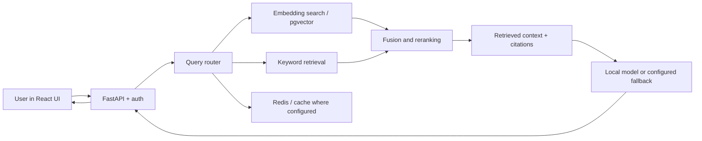

# Glass Expert AI — engineering case study

**Role:** Contributor to a collaborative engineering AI project.  
**Domain:** Glass science and manufacturing knowledge retrieval.  
**Public code:** [MTAAI/Glass_Engineer](https://github.com/MTAAI/Glass_Engineer) · [Arjun development branch](https://github.com/MTAAI/Glass_Engineer/tree/Arjun)

> This case study is based solely on code, history and evaluation files already published in the public repository. The application is a team effort. The linked commits show the work attributable to the author name `Arjun`; they should not be read as sole ownership of later team improvements.

## Problem and approach

Technical users need document-grounded answers about glass composition, defects, manufacturing and process guidance. A useful system needs retrieval quality, source attribution, bilingual handling and careful fallbacks when the relevant evidence is unavailable.

This diagram summarizes architectural components found across the public codebase, not a claim that every branch or deployment has every feature enabled at once.

## Attributable code contributions

| Area | Evidence | What was developed or modified |
|---|---|---|
| RAG foundation | [March 1 implementation commit](https://github.com/MTAAI/Glass_Engineer/commit/29d459a5a3f43e064b8ad8dd682abec04229f99a) | Ingestion/extraction, FastAPI routes, retrieval, data/schema scaffolding and tests |
| User interface + engineering endpoints | [March 4 implementation commit](https://github.com/MTAAI/Glass_Engineer/commit/75f7be7c6dc95690b8f0929a5381d29a4aa66ee9) | React UI, API endpoints, retrieval and reranking work |
| Hybrid retrieval refinement | [BM25 + RRF commit](https://github.com/MTAAI/Glass_Engineer/commit/97a4840) | Hybrid keyword/dense retrieval and reciprocal-rank fusion |
| Caching and throughput safeguards | [Semantic caching](https://github.com/MTAAI/Glass_Engineer/commit/23881a0) · [GPU semaphore](https://github.com/MTAAI/Glass_Engineer/commit/d30e149) | Caching pathway and bounded inference concurrency |
| Evaluation and testing | [Retriever tests](https://github.com/MTAAI/Glass_Engineer/commit/507be5e) · [Evaluation commit](https://github.com/MTAAI/Glass_Engineer/commit/3356173) | Retrieval/unit tests and recorded evaluation experiments |

These links are evidence of code contributions; commit labels or author's benchmark descriptions are not independent proof of system-wide performance.

## Publicly recorded evaluation snapshot

The shared repository includes [evaluation files](https://github.com/MTAAI/Glass_Engineer/tree/main/data/evaluation/results). The following figures describe **specific experiments dated March 23, 2026**, not current production SLAs:

| Evaluation | Recorded result | Caveat |
|---|---|---|
| English Qwen14B experiment | 48 evaluated questions; 68.21% composite score | 2 recorded errors, average 39.1-second response latency |
| English experiment | 4.2083/5 mean judge score | Model-based scoring; human validation not independently verified |
| Farsi Qwen14B experiment | 15 questions; 93.3% language accuracy | 5 recorded errors; this percentage is language correctness, **not** overall answer accuracy |
| Farsi latency | 47.6 seconds average | Different test set/conditions; cannot compare directly with English latency |

[English result JSON](https://github.com/MTAAI/Glass_Engineer/blob/main/data/evaluation/results/eval_summary_qwen14b-en-v2-full_20260323_025802.json) · [Farsi result JSON](https://github.com/MTAAI/Glass_Engineer/blob/main/data/evaluation/results/eval_summary_qwen14b-farsi-v3_20260323_025758.json)

**What these results tell us:** the system includes meaningful AI engineering, but its recorded response times and error counts reveal significant scope for reliability, corpus coverage and latency optimization. The public evidence does not establish 500+ daily requests, sub-two-second response times, business savings, or production uptime.

## Engineering decisions worth discussing in interviews

- **Grounding:** use retrieval and citations to reduce unsupported answers. Measure answer quality and refusal behavior separately.
- **Retrieval:** dense search alone can miss exact engineering terms; keyword retrieval, hybrid fusion and reranking are useful but need real ablation tests.
- **Multilingual:** English and Farsi performance must be evaluated on separate, representative sets; translating a query is not equivalent to bilingual retrieval quality.
- **Performance:** caching, batching and bounded concurrency can help, but report p50/p95 latencies and cache hit rates from comparable workloads.
- **Security:** avoid releasing customer data, credentials, internal deployments or proprietary model artifacts without employer permission.

## Reproducibility and limitations

The [team README](https://github.com/MTAAI/Glass_Engineer#quick-start) describes its software stack and local setup. Running the full pipeline may additionally require model artifacts, compatible datasets, hardware and service credentials not provided in this case study. No independent end-to-end production deployment is claimed here.

A good next iteration would publish a sanitized reproducible evaluation subset, automated test pass rate, source-attribution examples, deployment topology, p95 latencies, and measurable before/after retrieval comparisons.

---

**Transparency:** Team-owned project. Publicly available evidence only. Technical case study, not an endorsement by the employer.
